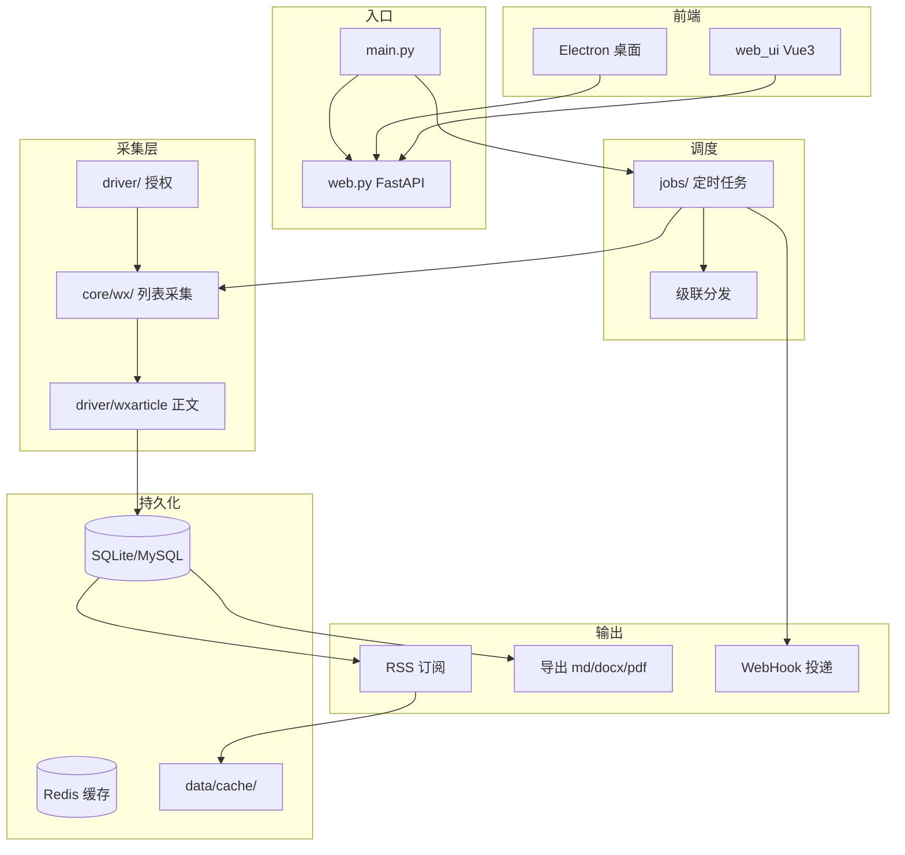

# 系统架构

## 整体架构

## 请求路由分层

| 路径 | 处理器 | 说明 |
|------|--------|------|
| `/api/*` | apis/ routers | REST API（JWT/AK 认证） |
| `/feeds/*` | apis/rss feeds_router | RSS 公开订阅 |
| `/assets/*` | static/ | 前端静态资源 |
| `/views/*` | views/ | 遗留 HTML 预览 |
| `/*` | static/index.html | SPA 回退 |

## 启动生命周期

1. 可选内置 Redis
2. `-init True` → 建表 + 默认 admin
3. 启动授权服务
4. 级联：子节点 sync + task worker / 父节点 schedule
5. `-job True` → 定时采集
6. uvicorn 启动 FastAPI（默认 8001）

## 数据目录

| 路径 | 用途 |
|------|------|
| `data/db.db` | SQLite 数据库 |
| `data/cache/rss/` | RSS 缓存 |
| `data/cache/content/` | 正文缓存 |
| `data/export_history.json` | 导出历史 |

## 相关概念

- [[微信公众号采集]]
- [[RSS订阅服务]]
- [[级联系统]]
- [[认证体系]]

## 相关模块

- [[core模块]]
- [[apis模块]]
- [[driver模块]]
- [[jobs模块]]
- [[web_ui模块]]
