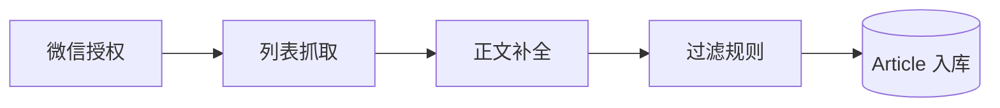

# 微信公众号采集

## 概述

WeRSS 的核心能力：从微信公众号抓取文章列表与正文，经过滤规则清洗后入库，供 RSS 订阅与导出使用。

## 采集管道

## 三种采集驱动

| 模式 | 配置项 | 实现 | 适用场景 |
|------|--------|------|----------|
| web | `gather.model=web` | `core/wx/model/web.py` | Playwright 浏览器模拟 |
| app | `gather.model=app` | `core/wx/model/app.py` | App 协议采集 |
| api | `gather.model=api` | `core/wx/model/api.py` | 微信公众平台 API |

基类：[[core模块]] 中 `core/wx/base.py` 统一调度。

## 两种授权模式

| 模式 | 配置 | 驱动 |
|------|------|------|
| Web 扫码 | `server.auth_web=True` | [[driver模块]] `driver/wx.py`（Playwright） |
| API Token | `server.auth_web=False` | `driver/wx_api.py` |

授权服务由 `main.py` 启动时调用 `driver.auth.start_auth_service()`。

## 核心功能

- **列表抓取**：按公众号 `faker_id` 分页获取文章列表
- **正文补全**：`driver/wxarticle.py` 抓取单篇 HTML 正文
- **过滤清洗**：[[FilterRule]] 全局/按公众号 HTML 过滤规则
- **状态追踪**：`has_content` 标记正文是否已补全

## 相关模块

- [[driver模块]] — 授权与浏览器自动化
- [[jobs模块]] — 定时采集调度（`jobs/mps.py`）
- [[core模块]] — 采集逻辑与数据持久化

## 关键实体

- [[Feed]] — 公众号订阅源，`faker_id` 是采集关键 ID
- [[Article]] — 文章，`mp_id` 关联 Feed

## 相关文档

- [[项目概述摘要]]

## 注意事项

- 授权过期需重新扫码，可通过 [[定时任务调度]] 中的通知渠道提醒
- 数据中心 IP 可能被微信封锁，需配置代理（compose/singbox 侧车）
- 采集间隔由 `config.yaml` 的 `interval` 控制（1-60 秒）
