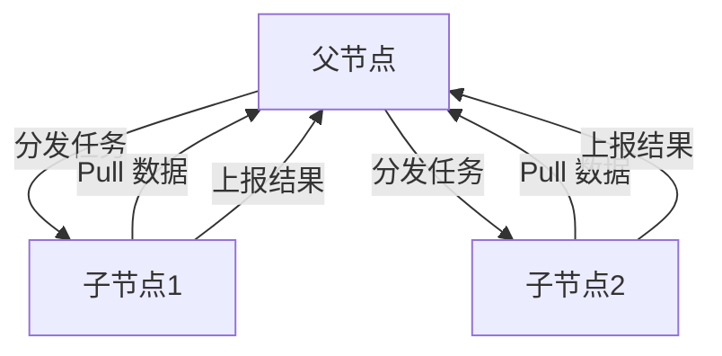

# 级联系统

## 概述

WeRSS 的父子节点架构，用于扩展采集能力：父节点管理子节点、分发任务；子节点拉取数据并执行采集，上报结果。

## 拓扑



## 核心组件

| 组件 | 路径 | 职责 |
|------|------|------|
| 级联管理器 | `core/cascade.py` | 节点 CRUD、客户端通信 |
| 级联 API | `apis/cascade.py` | 管理接口 |
| 同步服务 | `jobs/cascade_sync.py` | 子节点定期 Pull |
| 任务分发 | `jobs/cascade_task_dispatcher.py` | 智能任务分配 |

## 节点类型

| 类型 | node_type | 能力 |
|------|-----------|------|
| 父节点 | 0 | 管理子节点、分发任务、接收结果 |
| 子节点 | 1 | 拉取数据、执行任务、心跳上报 |

## 认证优先级

```
级联节点 AK/SK → 用户 AK/SK → JWT Token
```

详见 [[认证体系]]。

## 启动逻辑

`main.py` 根据 `cascade.enabled` 和 `cascade.node_type` 决定：
- **子节点**：启动 `cascade_sync` + `start_child_task_worker`
- **父节点/未启用**：启动 `cascade_schedule_service`

## 关键实体

- [[CascadeNode]] — 节点信息与凭证
- [[MessageTask]] — 可被父节点分发到子节点执行

## 相关文档

- [[级联系统文档摘要]]

## 注意事项

- 子节点需配置父节点地址与级联 AK/SK
- 任务拉取间隔：`cascade.task_poll_interval`（默认 30 秒）
- 同步方向：Pull（子→父）为主
